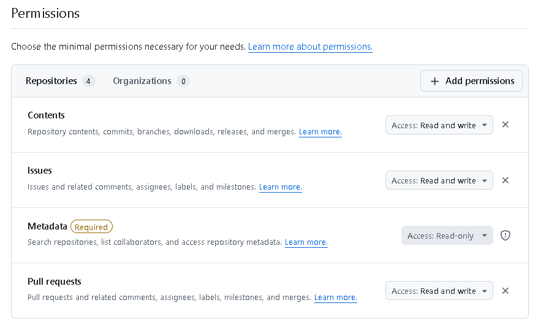

# Release

This project has three independent release streams. They are intentionally not forced onto one shared version number.

## Release streams

`release.yaml` declares artifact versions. On `release-on-merge` PRs, release targets are inferred from the changed files.

```yaml
release:
  mode: auto
```

The inferred release targets are:

- backend: `images/ocis-subpath/**` changed, or `release.yaml` changed `ocis.upstreamRef`, `ocis.imageTag`, or `ocis.repo`
- patcher: `images/web-assets-patcher/**` or `scripts/build-patcher-image.sh` changed, or `release.yaml` changed `web.*` or `patcher.*`
- chart: `charts/ocis-subpath/**` changed, or `release.yaml` changed `chart.*`

Manual overrides are still supported when needed:

```yaml
release:
  mode: auto
  ocis: false
  patcher: true
  chart: false
```

### Patched oCIS backend image

The backend image version is anchored to the upstream oCIS version.

```text
ghcr.io/<owner>/ocis-subpath:8.0.1-subpath.1
```

The format is:

```text
<upstream-ocis-version>-subpath.<patch-revision>
```

Use a new patch revision when this repository changes the backend patch without changing the upstream oCIS version. Reset the patch revision when moving to a new upstream oCIS version.

Release triggers:

- Merge a PR labeled `release-on-merge`
- Manual workflow: `Release oCIS backend`

The workflow builds `images/ocis-subpath` and pushes `ghcr.io/<owner>/ocis-subpath`.

### ownCloud Web assets patcher image

The patcher has its own SemVer because its Python patching behavior can change independently from ownCloud Web. The image also gets a compatibility tag tied to the built ownCloud Web version.

```text
ghcr.io/<owner>/ocis-web-assets-patcher:0.4.0
ghcr.io/<owner>/ocis-web-assets-patcher:web-v12.3.3-subpath.1
ghcr.io/<owner>/ocis-web-assets-patcher:0.4.0-web-v12.3.3-subpath.1
```

Release triggers:

- Merge a PR labeled `release-on-merge`
- Manual workflow: `Release Web assets patcher`

The SemVer tag describes the patcher implementation. The `web-...-subpath.N` tag describes the bundled upstream ownCloud Web compatibility.

### Helm chart

The chart uses normal Helm SemVer. It represents the Kubernetes manifests, schema, and default image tag combination.

```text
oci://ghcr.io/<owner>/charts/ocis-subpath --version 0.2.0
```

Release triggers:

- Merge a PR labeled `release-on-merge`
- Manual workflow: `Release Helm chart`

Update `charts/ocis-subpath/Chart.yaml` and `charts/ocis-subpath/values.yaml` through a PR before cutting a chart release. The chart should point to released backend and patcher image tags by default.

## Upstream Tracking

Upstream tracking is deliberately separate from publishing.

The `Track upstream releases` workflow runs weekly and can also be started manually. It checks the latest GitHub releases for:

- `owncloud/ocis`
- `owncloud/web`

When either upstream moved beyond the chart defaults, the workflow opens an `upstream-tracking` issue and a draft PR. It does not build or push release images.

The draft PR updates:

- `release.yaml`
- `images/ocis-subpath/Dockerfile` default `OCIS_REF`
- `scripts/build-patcher-image.sh` default `OWNCLOUD_WEB_REF` and local image tag
- `charts/ocis-subpath/values.yaml` default backend and patcher image tags
- `charts/ocis-subpath/Chart.yaml` chart patch version and `appVersion`
- `docs/e2e.md` example patcher image tag

The expected flow is:

1. Upstream tracking opens an issue.
2. Upstream tracking opens a draft PR with default version updates.
3. CI and Helm-on-kind E2E run against the draft PR.
4. A human closes the PR if the update is not acceptable, or marks it ready and merges it if it is acceptable.
5. The `release-on-merge` label triggers backend, patcher, and chart release workflows after merge.

This keeps GHCR releases tied to validated commits. Automatic upstream release detection should not directly publish images because upstream oCIS or ownCloud Web can break the local patch set, frontend URL assumptions, or E2E behavior. Closing the draft PR discards the proposed version changes because they never reach `main`.

The generated draft PR includes the `release-on-merge` label by default. Merging that PR is the explicit release approval. Remove the label before merging if the defaults should be merged without publishing release artifacts.

## Patcher-only changes

When only the patcher implementation changes, backend is not released because no backend-tracked files changed. Update `release.yaml` only for the patcher version and image tag:

```yaml
release:
  mode: auto

patcher:
  version: 0.1.1
  imageTag: web-v12.3.3-subpath.2
```

If `charts/ocis-subpath/values.yaml` is also updated to point at the new patcher image by default, the chart release is inferred automatically. If chart defaults are unchanged, only the patcher image is released.

For a patcher logic change against the same ownCloud Web version, increment both:

- `patcher.version`, because the patcher implementation changed
- the `subpath.N` suffix in `patcher.imageTag`, because the generated patched asset behavior changed for the same upstream Web ref

For CI/E2E to run on the generated draft PR, configure a repository secret named `UPSTREAM_TRACKING_TOKEN` with permission to push branches and open pull requests. The tracking workflow requires this secret before creating a draft PR. GitHub's default `GITHUB_TOKEN` is not used for the PR because events caused by it may not trigger other workflows due to GitHub's recursion prevention.

`gh` can register the secret, but it cannot safely mint a repository-scoped PAT by itself in a non-interactive command. Create a fine-grained personal access token in GitHub's UI, scoped to this repository.

GitHub UI steps:

1. Open https://github.com/settings/personal-access-tokens/new.
2. Set `Token name` to `ocis-subpath upstream tracking`.
3. Set `Expiration` to a finite value, for example 90 days or 180 days.
4. Set `Resource owner` to the user or organization that owns this repository.
5. Set `Repository access` to `Only select repositories`.
6. Select this repository.
7. Under `Repository permissions`, set:
   - `Contents`: `Read and write`
   - `Pull requests`: `Read and write`
   - `Issues`: `Read and write`



8. Leave other permissions as `No access`.
9. Click `Generate token`.
10. Copy the token immediately; GitHub will not show it again.

For an organization-owned repository:

- Select the organization as `Resource owner`.
- If the organization does not appear, the organization may block fine-grained personal access tokens, or your account may not be eligible to create one for that organization.
- If the organization requires approval, the generated token may be `pending` until an organization owner approves it.
- The token only has the permissions of the user who created it. Use a dedicated automation or bot user that has access to the repository when possible.
- After creating the token, an organization owner may need to approve it from the organization's personal access token settings before the tracking workflow can create branches, issues, and pull requests.

You can also open a pre-filled token form and then confirm the selected owner/repository before generating the token:

```text
https://github.com/settings/personal-access-tokens/new?name=ocis-subpath%20upstream%20tracking&description=Create%20upstream%20tracking%20draft%20PRs%20and%20issues&expires_in=90&contents=write&pull_requests=write&issues=write
```

Required permissions:

- Contents: Read and write
- Pull requests: Read and write
- Issues: Read and write

Then register it:

```bash
read -rsp "UPSTREAM_TRACKING_TOKEN: " UPSTREAM_TRACKING_TOKEN
printf '\n'

gh secret set UPSTREAM_TRACKING_TOKEN \
  --repo "$(gh repo view --json nameWithOwner -q .nameWithOwner)" \
  --body "${UPSTREAM_TRACKING_TOKEN}"

unset UPSTREAM_TRACKING_TOKEN
```

For fish:

```fish
read --silent --prompt-str "UPSTREAM_TRACKING_TOKEN: " UPSTREAM_TRACKING_TOKEN
printf '\n'

gh secret set UPSTREAM_TRACKING_TOKEN \
  --repo (gh repo view --json nameWithOwner -q .nameWithOwner) \
  --body "$UPSTREAM_TRACKING_TOKEN"

set --erase UPSTREAM_TRACKING_TOKEN
```

Verify that the secret exists:

```bash
gh secret list \
  --repo "$(gh repo view --json nameWithOwner -q .nameWithOwner)" \
  | grep '^UPSTREAM_TRACKING_TOKEN'
```

If you already use `gh auth login` with a bot account dedicated to automation, you can inspect that token with `gh auth token`, but do not store your normal personal CLI token as `UPSTREAM_TRACKING_TOKEN` unless you intentionally want PRs to be authored with that account.

## Version examples

Move from oCIS `8.0.1` to `8.0.2`:

```text
ocis/v8.0.2-subpath.1
```

Patch this repository's backend changes while staying on oCIS `8.0.2`:

```text
ocis/v8.0.2-subpath.2
```

Move ownCloud Web from `12.3.3` to `12.4.0` without changing patcher behavior:

```text
patcher/v0.4.0-web-v12.4.0-subpath.1
```

Change patcher behavior while staying on ownCloud Web `12.4.0`:

```text
patcher/v0.4.1-web-v12.4.0-subpath.2
```

Update chart defaults to consume the above images:

```text
chart/v0.3.0
```
